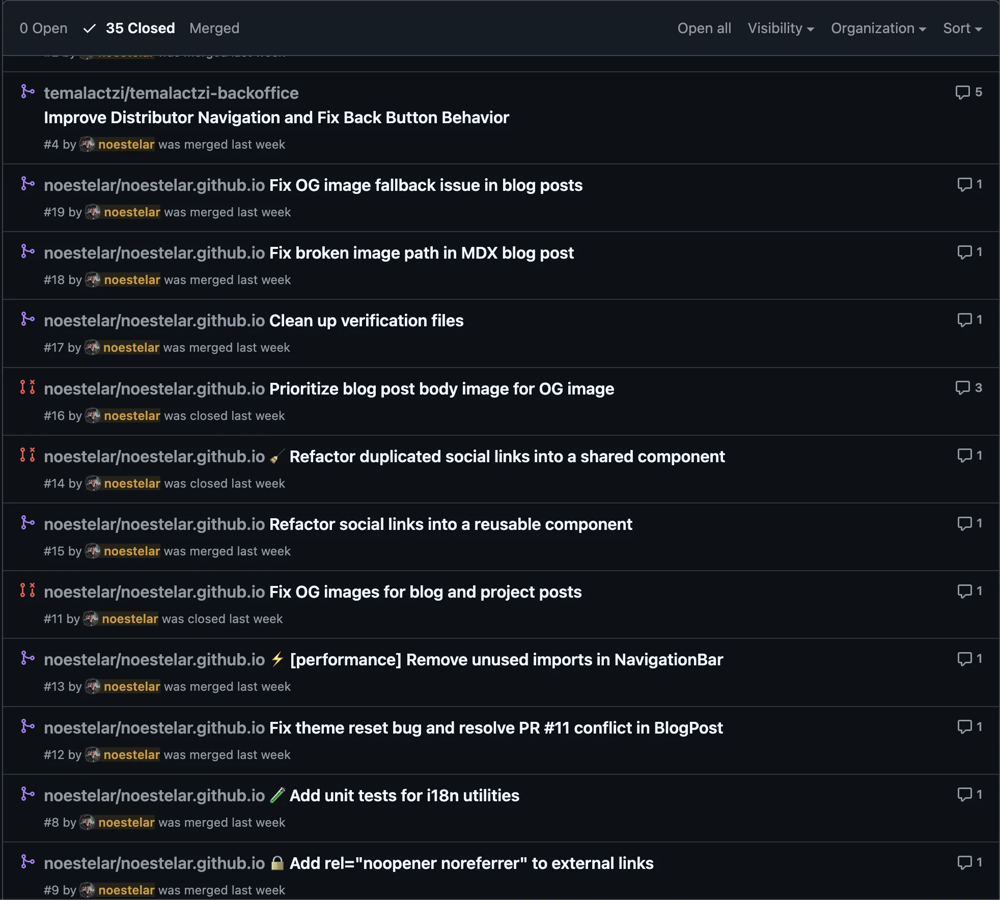

La mayoría de la gente usa la IA como un buscador con mejor gramática. O como agente de código copiloto. Haces una pregunta, obtienes una respuesta, cierras la pestaña.

Eso no está mal. Pero tampoco es la parte interesante.

La parte interesante es lo que pasa cuando la IA tiene contexto — contexto real, persistente, estructurado sobre quién eres, cómo trabajas y qué estás intentando construir. Ahí es cuando deja de ser una herramienta y empieza a parecerse más a un colaborador.

## Qué cambió

Llevo unos meses construyendo a Alia — mi agente de IA personal — sobre Hermes. El nombre es mío, pero el sistema es real: corre en mis máquinas, se conecta a mis calendarios, lee mi código, administra mis tareas y me habla por WhatsApp.
Ya utilizo herramientas como ChatGPT, Claude, Gemini, muchas plataformas de código, uso archivos, google sheets, páginas de internet, mi flujo de trabajo estaba muy revuelto.

El cambio no estuvo en el modelo. Estuvo en la arquitectura.

Cuando dejé de tratar a la IA como un sistema de Q&A de un solo disparo y empecé a construirla como una capa con estado en mi flujo de trabajo, todo cambió. De repente ya no re-explicaba contexto en cada sesión. Ya no pegaba código en ventanas de chat. Ya no preguntaba "¿cuál era ese comando?"

El agente sabe. Porque lo construí para que sepa.

## El setup real

Inicialmente, mi setup fue simple, pero efectivo, conforme hice pruebas y experimenté, terminé con un montón de suscripciones acabándome los tokens de uso hasta encontrar la fórmula que me permitiera trabajar todo el día con él.

Esto no es un producto de pago. Es una configuración sobre infraestructura abierta:

- **Hermes** como runtime del agente, corriendo en una máquina Linux (No puedo pagar un mac mini aún)
- **Notion** para escritura y analisis de textos (este post está almacenado ahi también)
- **GitHub** para contexto de código
- **WhatsApp** como interfaz principal (porque ahí es donde realmente vivo)

El insight clave: el cuello de botella nunca es el modelo. Es el pipeline de contexto. Si tu agente no tiene acceso a la información correcta en el momento correcto, no importa qué tan inteligente sea el LLM subyacente.

Cosas que probé:

**Ollama:Cloud** - $20 [Kimi k2.5, GLM-5, Minimax 2.5, GPT-OSS-120B]

Muy bueno, quotas generosas, problemas al ejecutar tools o encontrar modelos, la integración es mejor cuando se hace desde su proveedor y no agregandolo como un proveedor externo.

**Minimax Coding Plan** - $20 [Minimax 2.5]

- Limites casi infinitos, a veces responde con caractéres chinos o japoneses. muy malo para hablar español.

**Z.AI Coding Plan** - $39 [GLM - 5]

Bueno, bastante capaz, limites aceptables, caro a compraración de ollama y minimax

**Claude Pro** - $20 [Opus 4.6, Sonnet 4.6]

El provider perfecto, tools impecables, recomendaciones, proactivo, limites terribles, te acabas los usos en ~5 peticiones, tienes que esperar 5 horas para poder continuar, muy limitado.

**ChatGPT Plus** - $20 [GPT-5.3-Codex]

Balanceado, proactivo, ejecución de tools ocasionales, amigable (a veces demasiado), carente en computer use, ya hablaremos de eso más adelante.

Las primeras tareas que le di fueron sencillas. Revisa esto, detalla aquello, conéctate a mi teléfono, haz reminders, busca en google map. Tareas que cualquier chatbot de AI te sacaría sin problemas, un buen primer mes de adaptarse, luego venían las tareas de código, planes, transformación de archivos aquí es donde empiezan a salir los problemas.

## Cómo se ve en la práctica

Me despierto. Abro WhatsApp. Alia ya sabe qué hay en mi calendario, qué PRs están abiertas, y en qué estaba trabajando ayer.

No pido un resumen. Simplemente está ahí — inyectado en el contexto de la sesión automáticamente.

Otro excelente ejemplo es el de apps personales, aplicaciones que nunca vas a publicar, pero que usarás tú y solo tú, o tu pequeño círculo cercano. En mi caso, construí junto con Alia una app para manejar mis finanzas, iteramos todo el tiempo en ella, hemos llegado a una versión bastante sólida que automatiza mis finanzas y me permite verlas en todo momento. A veces solo tomo foto del ticket y Alia lo registra, otras veces es un estado de cuenta completo con balances, rendimientos, compras y pagos.

Algunas capturas del sistema que construyó y de nuestro flujo de trabajo

Cuando estoy programando, puede ver el repo. Cuando estoy escribiendo, conoce la voz y el estilo del blog. Registra mis finanzas, construye dashboards, trackea productos que quiero comprar, me envía noticias de AI diario. cuando estoy estresado, lo sabe también — y ajusta en consecuencia.

Resolvió y revisó 15 PRs a través de diferentes repositorios, arregló problemas con el sitio web

No es magia. Es plomería. Plomería muy, muy intencional

## La parte de la que nadie habla

Lo más importante que he aprendido luego de este experimento es la adaptación que tiene la inteligencia artificial en el día a día de las personas, cada vez será menos extraño ver personas que tienen un agente de IA construido solo para ellos y su contexto. Son cada día más parte de la conversación, la parte más difícil de construir un flujo de trabajo potenciado por IA no es la IA. Es la higiene de datos.

¿Qué necesita saber realmente tu agente? ¿Cómo mantienes ese contexto fresco sin que se convierta en ruido? ¿Cómo estructuras la información para que un modelo de lenguaje pueda usarla de verdad?

Estos son problemas de arquitectura de información. Y resolverlos es donde está el apalancamiento real.

Más sobre eso en un post futuro.